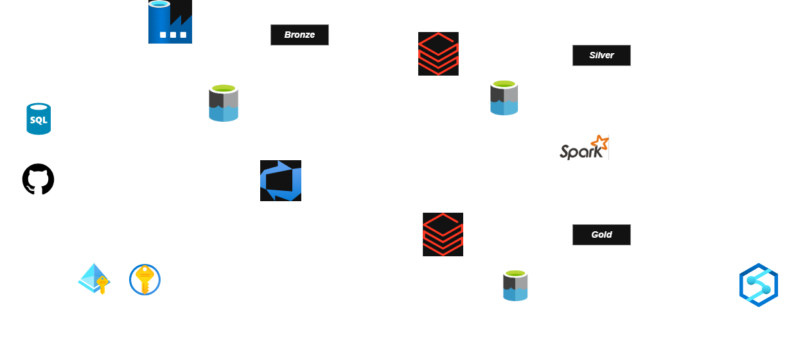

# 🎵 Spotify Data Engineering Pipeline


---

## 📌 Project Overview

A **production-grade, end-to-end cloud data engineering pipeline** built on **Azure Databricks** that ingests, transforms, and serves Spotify streaming data for business analytics.

The pipeline processes raw transactional Spotify data — user streams, track plays, and artist activity — through a **Medallion Architecture (Bronze → Silver → Gold)** to deliver a clean, analytics-ready data model consumed by a **Databricks SQL Warehouse**.

### 🎯 Business Problem Solved
> Music streaming platforms generate millions of events daily. Raw transactional data is unusable for analytics without transformation. This pipeline automates the full journey from raw SQL data to a governed, query-ready Star Schema — enabling insights into **listener behavior, track performance, and artist trends**.

---

## 🏗️ Architecture



### Pipeline Flow

```
SQL Database
     │
     ▼
[Azure Data Factory] ──► Bronze (Raw Parquet)
                              │
                              ▼
                    [Spark Structured Streaming] ──► Silver (Star Schema Delta)
                                                           │
                                                           ▼
                                               [Delta Live Tables] ──► Gold (Aggregated Delta)
                                                                              │
                                                                              ▼
                                                                   [Databricks SQL Warehouse]
```

## 💡 Key Highlights

- ⚡ **Streaming ingestion** using Auto Loader (`cloudFiles`) with schema evolution — handles late-arriving schema changes automatically
- 🔄 **Config-driven transformations** using Jinja2 templating for dynamic SQL — reduces Gold layer code duplication significantly
- 🔐 **Enterprise security** — Unity Catalog RBAC + Azure Key Vault + Managed Identity (zero credentials in code)
- 📦 **Infrastructure as Code** — fully deployable via Databricks Asset Bundles (DAB) across dev/prod environments
- 🧱 **Reusable transformation layer** — shared `utils/transformation.py` class used across Silver and Gold notebooks

---

## 🛠️ Tech Stack

| Category | Technology |
|----------|-----------|
| **Cloud Platform** | Microsoft Azure |
| **Orchestration** | Azure Data Factory (ADF) |
| **Compute** | Azure Databricks (Serverless) |
| **Storage** | Azure Data Lake Storage Gen2 |
| **Data Format** | Parquet (Bronze), Delta Lake (Silver/Gold) |
| **Stream Processing** | PySpark Structured Streaming, Auto Loader |
| **Batch Processing** | Delta Live Tables (DLT) |
| **Governance** | Unity Catalog, Azure Key Vault |
| **CI/CD** | Databricks Asset Bundles, GitHub |
| **Serving** | Databricks SQL Warehouse |
| **Language** | Python 3.10, SQL, YAML |

---

## 📁 Repository Structure

```
Spotify-Data-Engineering/
├── 📂 spotify_dab/                     # Databricks Asset Bundle (DAB)
│   ├── databricks.yml                  # Bundle config — targets, resources, jobs
│   ├── pyproject.toml                  # Python package config
│   ├── 📂 src/
│   │   ├── 📂 silver/
│   │   │   └── silver_dimensions       # Auto Loader streaming notebook
│   │   ├── 📂 gold/                    # Delta Live Tables notebooks
│   │   └── 📂 utils/
│   │       └── transformation.py       # Reusable PySpark transformation class
│   └── 📂 resources/                   # Pipeline & job YAML definitions
├── 📂 factory/                         # Azure Data Factory ARM templates
├── publish_config.json                 # ADF publish config
└── README.md
```

---

## 📊 Data Model (Star Schema — Silver Layer)

```
                    ┌─────────────────┐
                    │   DimArtist     │
                    │  artist_id  PK  │
                    │  artist_name    │
                    │  genre          │
                    │  country        │
                    └────────┬────────┘
                             │
┌─────────────┐   ┌──────────▼──────────────┐   ┌──────────────┐
│   DimUser   │   │       FactStream         │   │   DimTrack   │
│ user_id  PK ├───┤  stream_id   PK          ├───┤ track_id  PK │
│ user_name   │   │  user_id    FK           │   │ track_name   │
└─────────────┘   │  track_id   FK           │   └──────────────┘
                  │  artist_id  FK           │
                  │  listen_duration         │
                  │  updated_at              │
                  └──────────────────────────┘
```

---

## 🔄 Layer-by-Layer Breakdown

### 🥉 Bronze — Raw Ingestion
- **Tool:** Azure Data Factory
- **Source:** SQL Database (Spotify transactional tables)
- **Output:** Raw Parquet files in ADLS Gen2 `bronze/` container
- **Pattern:** Full load + incremental via ADF Copy Activity
- **Tables:** `FactStream`, `DimUser`, `DimTrack`, `DimArtist`

### 🥈 Silver — Cleanse & Conform
- **Tool:** PySpark Structured Streaming (Auto Loader)
- **Key features:**
  - Schema inference + evolution (`cloudFiles.schemaEvolutionMode = addNewColumns`)
  - Explicit checkpoint management on ADLS Gen2
  - System column removal (`_rescued_data`)
  - Business transformations via reusable `transformation.py` class
- **Output:** Delta tables with enforced schema in `silver/` container

### 🥇 Gold — Aggregate & Serve
- **Tool:** Delta Live Tables (DLT)
- **Key features:**
  - Config-driven dynamic SQL joins via Jinja2 templating
  - Fact + Dimension joins producing wide analytical tables
  - Serverless DLT pipeline for cost efficiency
- **Output:** Aggregated Delta tables consumed by SQL Warehouse

---

## 🔐 Security Architecture

- **Azure Key Vault** — all secrets/keys stored and referenced securely; no hardcoded credentials anywhere in the codebase
- **Unity Catalog** — catalog-level, schema-level, and table-level access control with full data lineage
- **Managed Identity** — Access Connector for Databricks authenticates to ADLS Gen2 without credentials in code

---

## 🚀 How to Deploy

### Prerequisites
- Azure Subscription with Databricks workspace (Unity Catalog enabled)
- ADLS Gen2 storage account
- Azure Data Factory instance
- Databricks CLI v0.200+

### 1. Clone the repo
```bash
git clone https://github.com/bhavith1993/Spotify-Data-Engineering.git
cd Spotify-Data-Engineering
```

### 2. Configure Databricks CLI
```bash
databricks configure --token
# Enter: workspace URL + Personal Access Token
```

### 3. Deploy the bundle
```bash
cd spotify_dab
databricks bundle deploy --target dev    # development
databricks bundle deploy --target prod   # production
```

### 4. Deploy ADF Pipelines
```
Azure Portal → Data Factory → Manage
→ ARM Template → Import
→ Upload templates from /factory folder
```

### 5. Run the pipeline
```bash
databricks bundle run spotify_etl_job --target dev
```

---

## 📂 Storage Layout

```
ADLS Gen2 (storagespotify2201)
├── 📁 bronze/
│   ├── DimUser/          ← Raw parquet from ADF
│   ├── DimTrack/
│   ├── DimArtist/
│   └── FactStream/
└── 📁 silver/
    ├── DimUser/
    │   ├── data/         ← Delta table files
    │   ├── schema/       ← Auto Loader inferred schema
    │   └── checkpoint/   ← Streaming offsets
    ├── DimTrack/
    ├── DimArtist/
    └── FactStream/
```

---

## 📈 Engineering Decisions

| Decision | Rationale |
|----------|-----------|
| Auto Loader over batch reads | Efficiently handles new file arrival without full directory scans |
| `trigger(availableNow=True)` | Processes all backlog then terminates — cost-efficient for scheduled runs |
| Explicit checkpoint paths on ADLS | Required by Databricks Serverless — no implicit temp locations allowed |
| Jinja2 for Gold SQL | Eliminates repetitive JOIN code — adding a new dimension = one config entry |
| DAB for deployment | Reproducible, version-controlled infrastructure across dev and prod |
| Reusable transformation class | Single source of truth for common PySpark operations across all layers |

---

## 👤 Author

**Sneha Pujani**

[](https://github.com/bhavith1993)

---

## 📄 License

This project is licensed under the MIT License — see the [LICENSE](./LICENSE) file for details.
